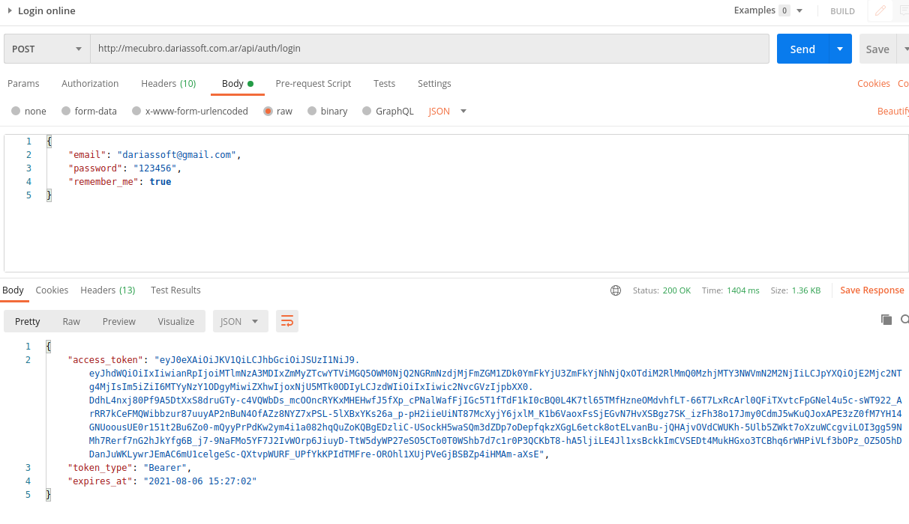
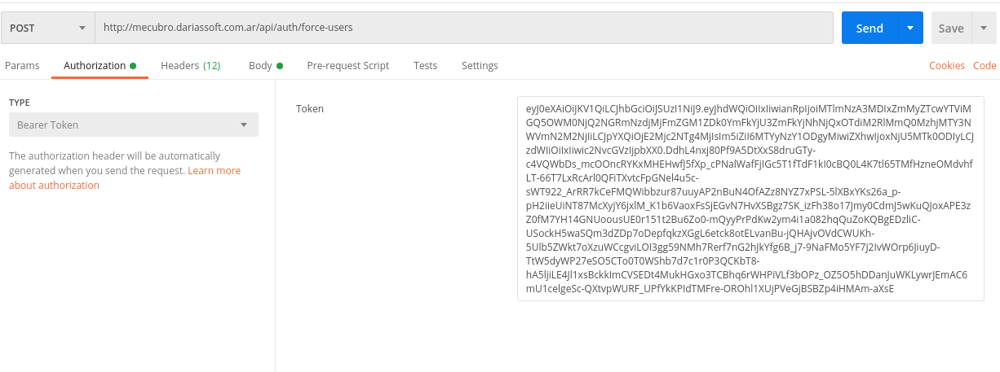
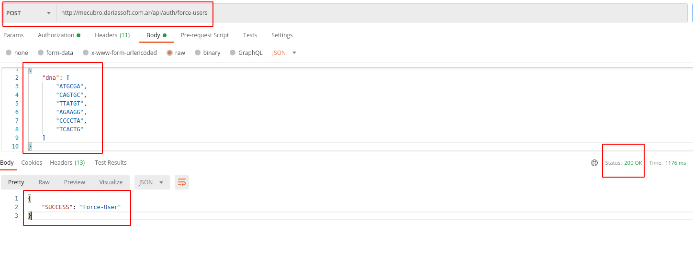
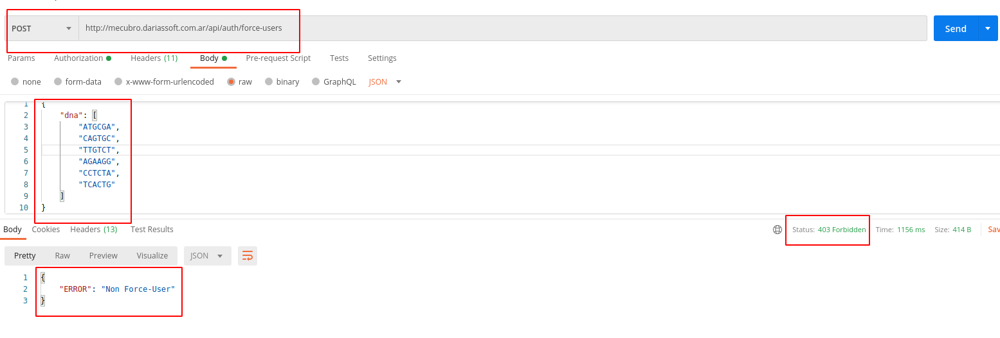
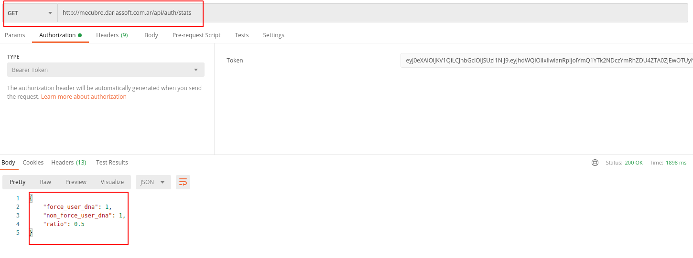

## Acerca del Problema isForceUser

Podra realizarse la verificacion de la prueba atraves de un cliente Rest como Postman. 

## Codigo Fuente GitHub https://github.com/dariassoft/mecubro

## Login
Lanzar la solicitud POST a
<pre>
http://mecubro.dariassoft.com.ar/api/auth/login
</pre>
parametros en Raw.
<pre>
{
    "email": "dariassoft@gmail.com",
    "password": "123456",
    "remember_me": true
}
</pre>

Se obtendra el token que se debe utilizar en todas las llamadas de pruebas.

## IsForceUser Function
Lanzar la solicitud POST a 
<pre>
http://mecubro.dariassoft.com.ar/api/auth/force-users
</pre>
en el Body como Raw agregar los datos de prueba de la siguiente manera.
<pre>
{
    "dna": [
        "ATGCGA",
        "CAGTGC",
        "TTGTCT",
        "AGAAGG",
        "CCTCTA",
        "TCACTG"
    ]
}
</pre>

El resultado puede ser un response 200 o 403, dependiendo si el usuario tiene cadena adn valida.

## Stats 
Lanzar la solicitud GET a
<pre>
http://mecubro.dariassoft.com.ar/api/auth/stats
</pre>

Se recibira una respuesta del tipo.
<pre>
{
    "force_user_dna": 1,
    "non_force_user_dna": 1,
    "ratio": 0.5
}
</pre>

